<!--Open Preview (Ctrl+Shift+V)-->
# Image Kernals:


## Table of Contents
* [Description](#description-)
* [Dependencies](#dependencies-)
* [Operations](#operations)
* [Usage Example](#usage-example-)
* [References](#references-)

## Description :
implementation of different image filters using a wide variety of kernals under convolution process

## Dependencies :
* [Numpy](http://www.numpy.org/)
* [Matplotlib](https://matplotlib.org/)

## Operations :

*All Figures renderd using* `Plot_Kernals`

### Identity
--------------------------
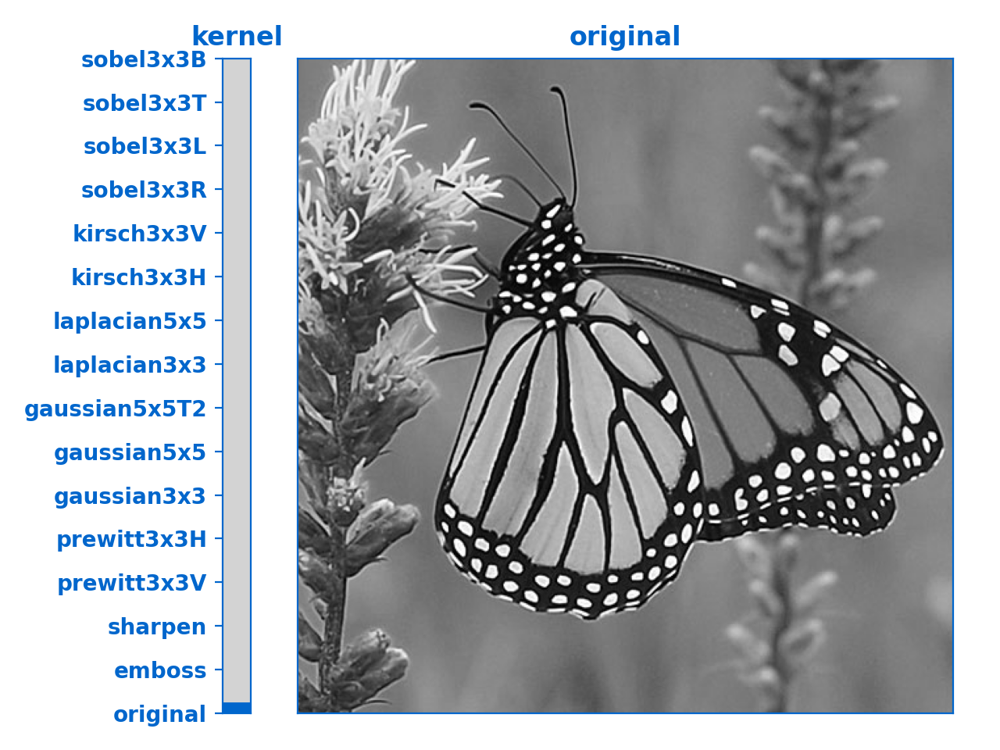

### embossing
--------------------------

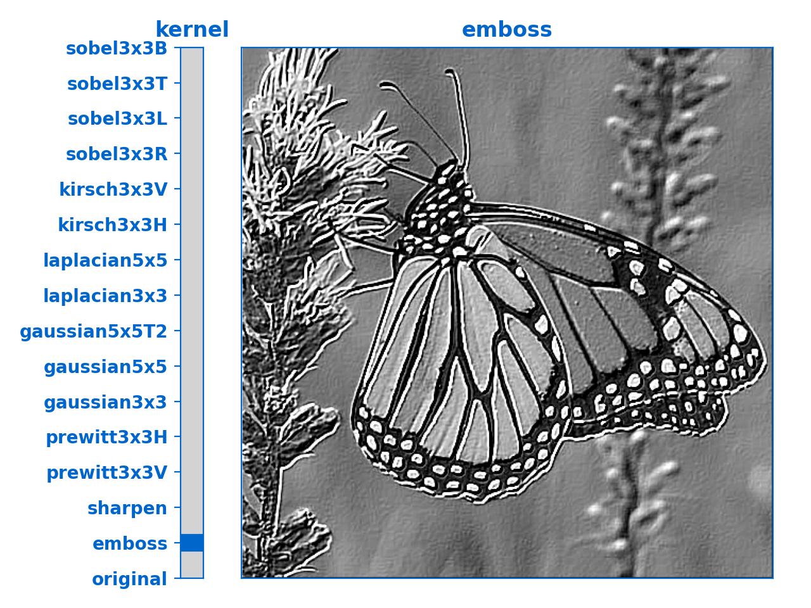

### sharpening
--------------------------

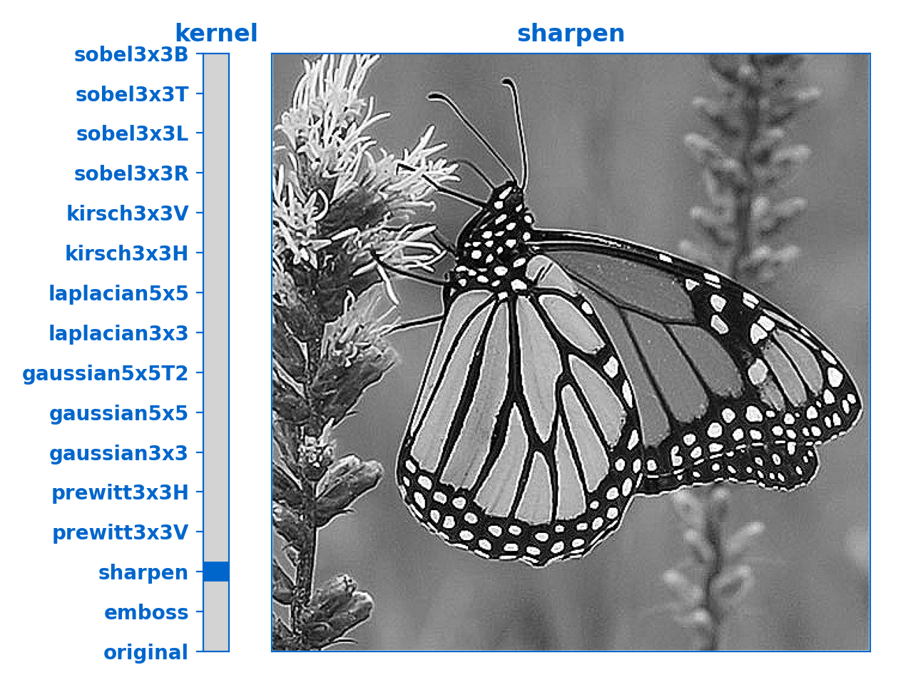

--------------------------

### Gaussian blur (aka. Gaussian smoothing)


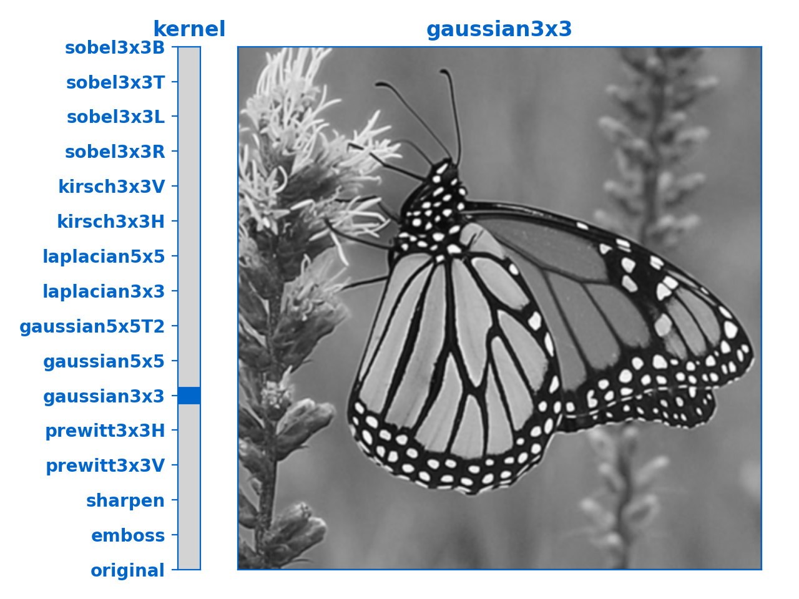

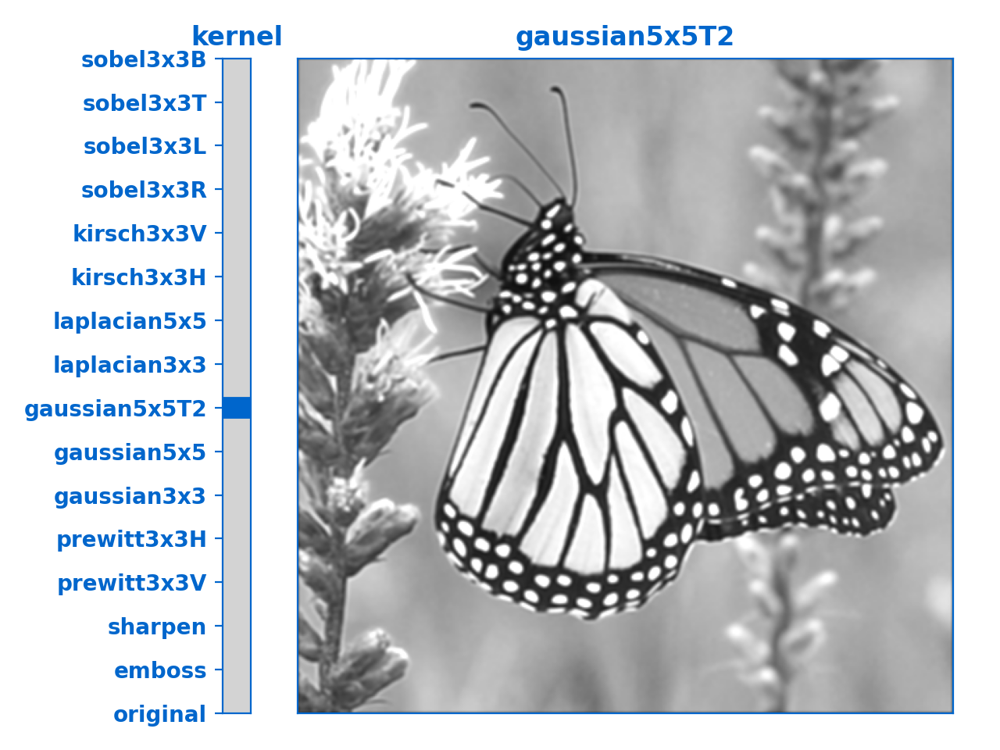

-------------------------------------

### Edge detection

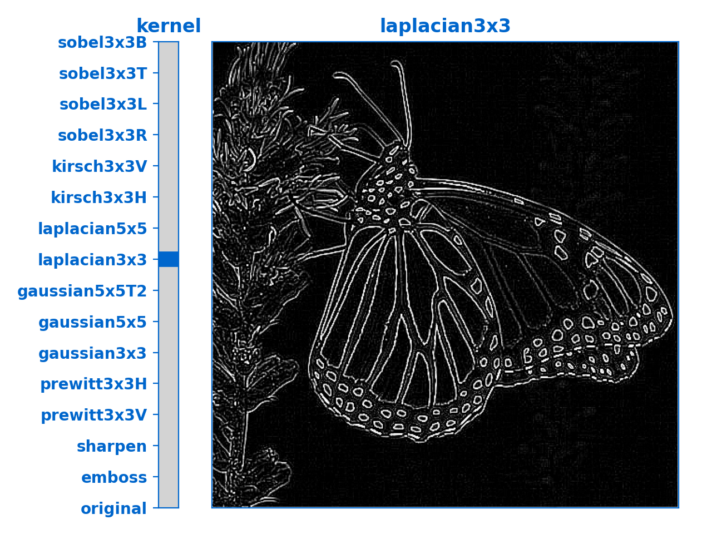
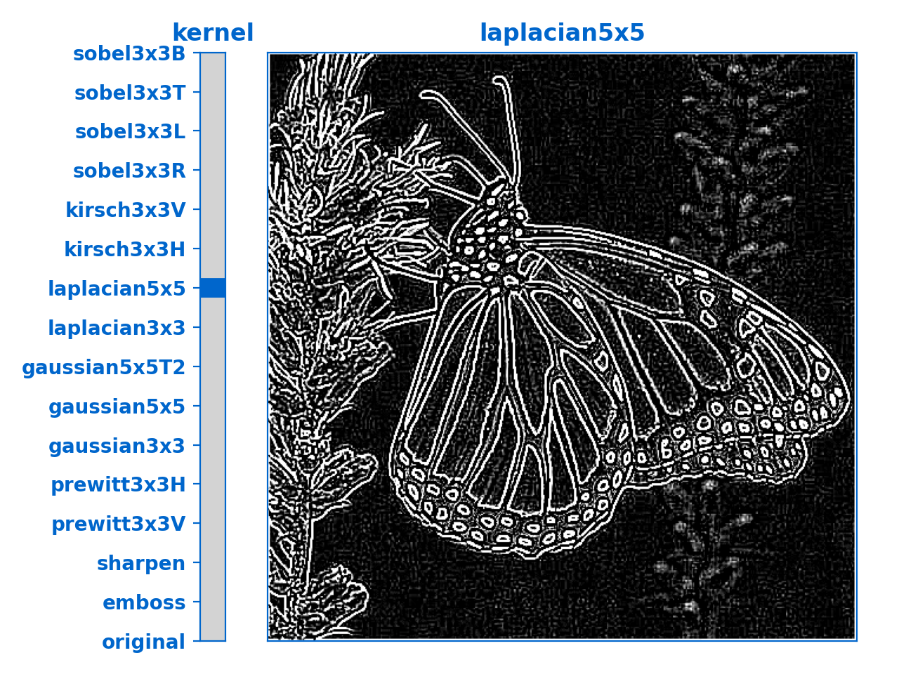
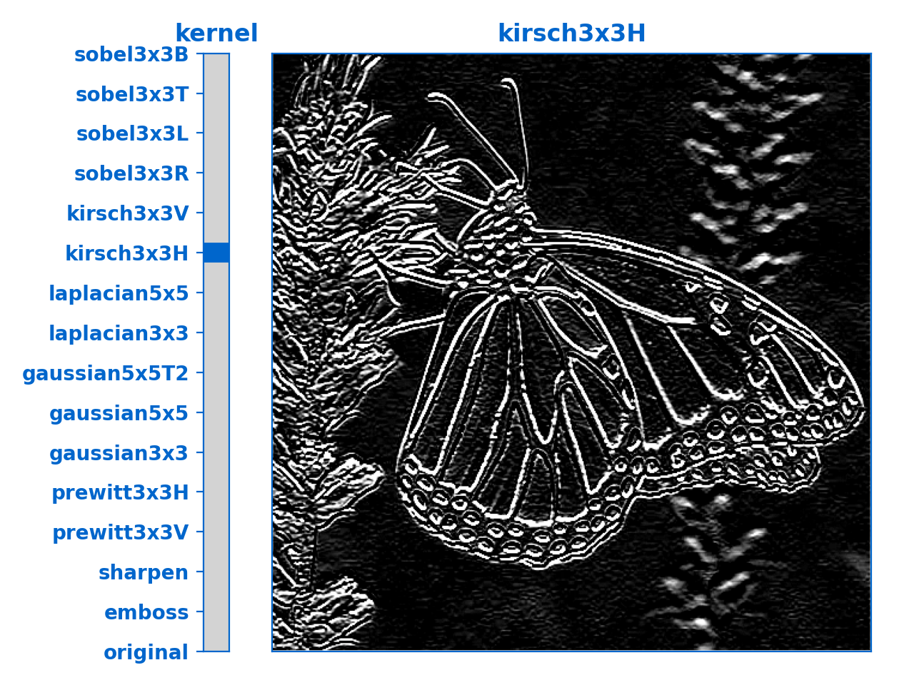
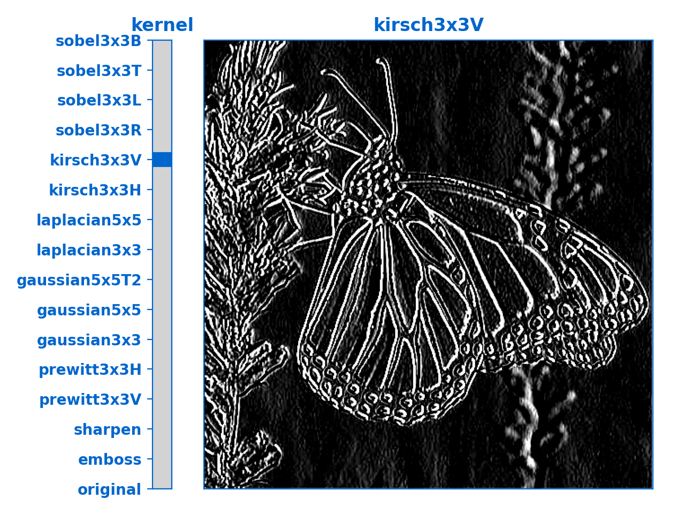
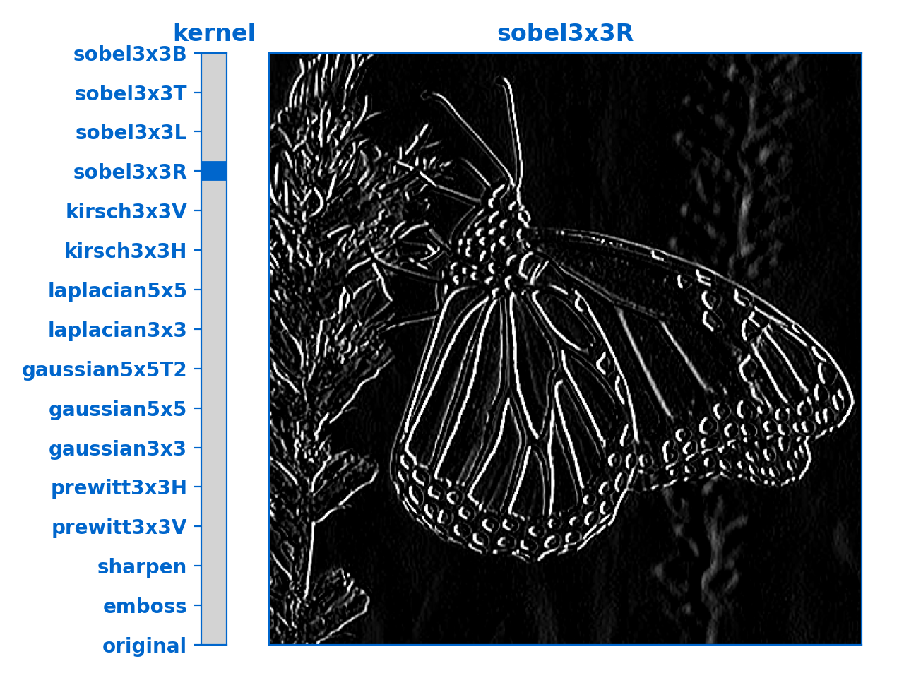
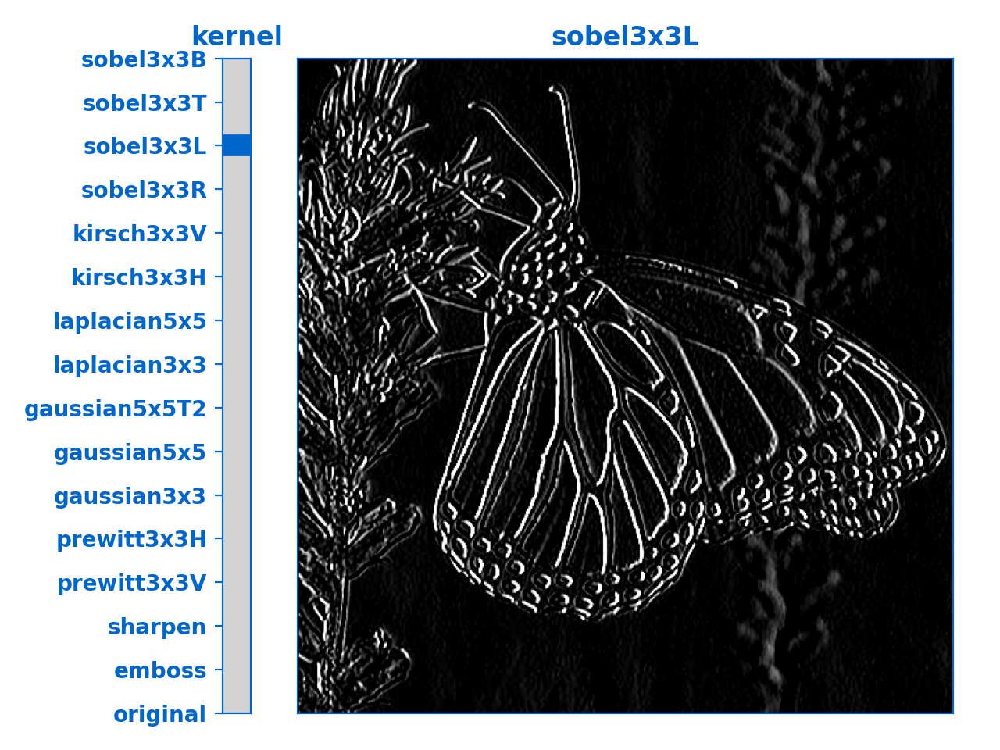
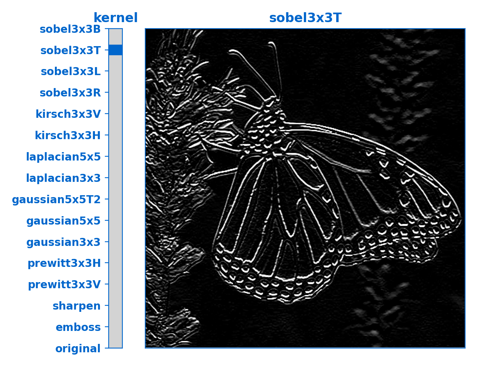

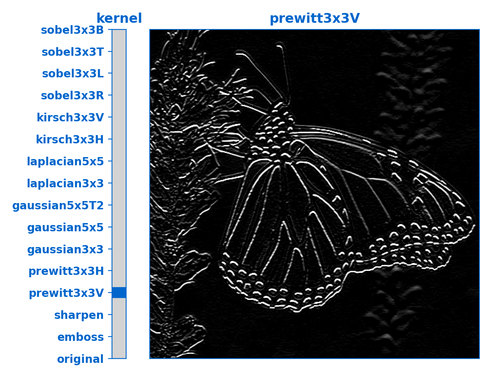
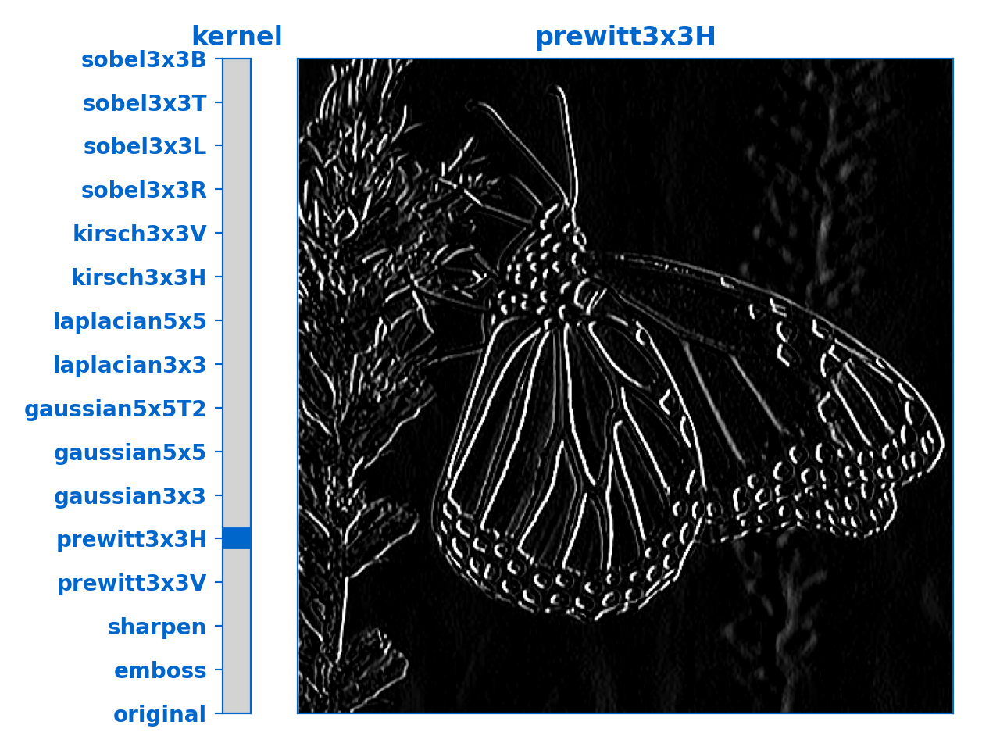


## Usage Example :
```python
import os
from plot_assest import Plot_Kernals

dir_path = os.path.dirname(os.path.realpath(__file__))

Plot_Kernals(dir_path + '/Images/monarch.jpg')
```


## References :
- **[wikipedia](https://en.wikipedia.org/wiki/Kernel_(image_processing))**
